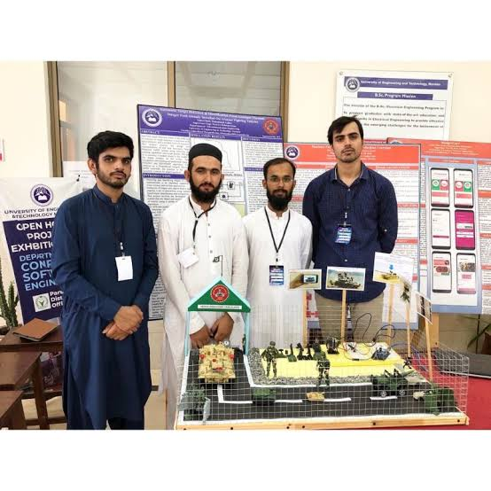
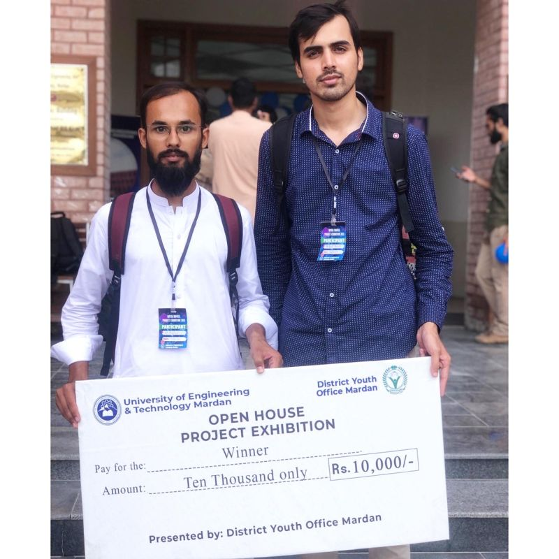
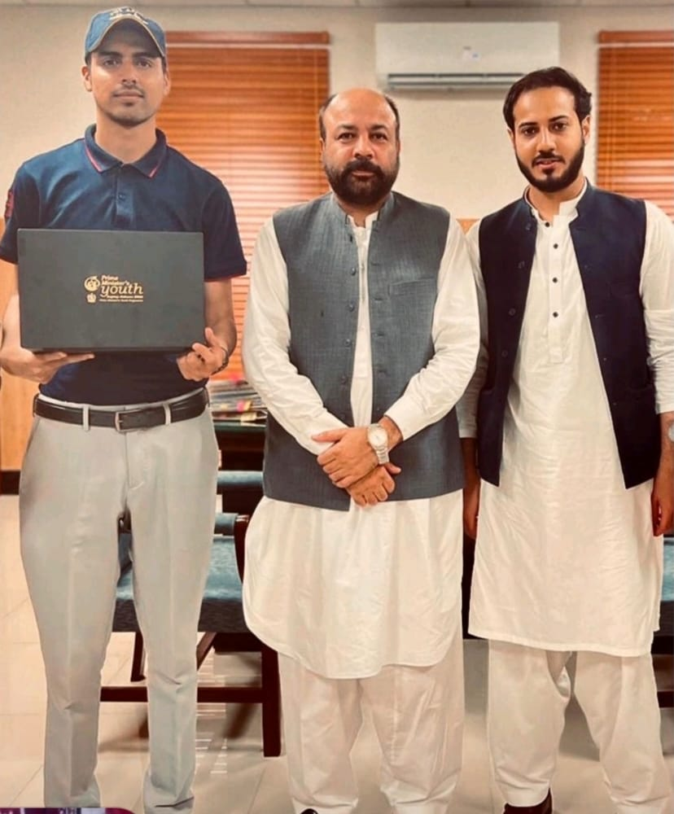
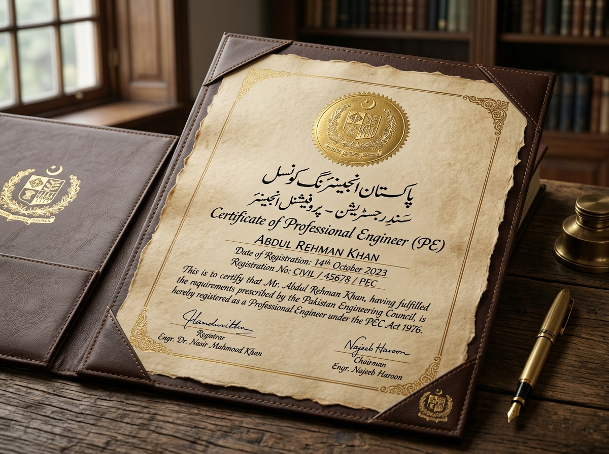

# Tehleel Basit — Telecommunication Engineer & Academic Portfolio

<p align="center">
  
</p>

<h3 align="center">Engr. Tehleel Basit</h3>
<p align="center">
  <b>Registered Telecommunication Engineer (PEC: TELE/8141) · Ph.D. Scholar · Lecturer · Data & Telecom Analyst</b><br>
  Mardan, Khyber Pakhtunkhwa (KPK), Pakistan<br>
  <a href="https://www.linkedin.com/in/tehleel-basit-50bb66216?utm_source=share_via&utm_content=profile&utm_medium=member_android">LinkedIn Profile</a>
</p>

---

## 📌 About

Official professional portfolio and academic showcase of **Engr. Tehleel Basit**. Highlights academic excellence, defense and industrial research sponsored by **Heavy Industries Taxila (HIT)**, awards, certifications, and teaching accomplishments.

- **Highest Distinction**: Prime Minister's Youth Laptop Scheme Merit Award 2023 (HEC Pakistan).
- **First Prize & Gold Award**: Best BS Final Year Project at UET Mardan Open House Exhibition (2022).
- **Defense Sponsorship**: Automated Target Detection & Identification system built for Heavy Industries Taxila (HIT).
- **Professional Credential**: Registered Engineer with Pakistan Engineering Council (PEC: TELE/8141).

---

## 🏆 Featured Highlights & Visual Archive

| Project / Recognition | Preview | Details |
| :--- | :---: | :--- |
| **Combat Vehicle Automation System** |  | Automatic target detection & categorization from combat thermal feeds sponsored by Heavy Industries Taxila (HIT). |
| **UET Mardan Exhibition 1st Prize** |  | Official PKR 10,000 winner's cheque ceremony & best hardware project trophy at UET Mardan. |
| **Prime Minister's Merit Laptop Award** |  | Higher Education Commission merit laptop distribution ceremony recognition. |
| **BS Convocation & Degree** |  | Graduated with 3.48 CGPA (81.65%) from UET Mardan. |
| **PEC Engineering License** |  | Licensed Telecommunication Engineer with Pakistan Engineering Council. |

---

## 🚀 Deployment to Vercel

This repository is optimized for one-click deployment on **Vercel**:

1. Push this repository to **GitHub**.
2. Connect your GitHub repository to **Vercel** (`New Project`).
3. Vercel automatically detects the Vite framework settings:
   - **Framework Preset**: Vite
   - **Build Command**: `npm run build`
   - **Output Directory**: `dist`
4. Deploy! All assets in `public/` and `src/assets/images/` are bundled and served with high-performance caching.

---

## 💻 Local Development

```bash
# Install dependencies
npm install

# Start development server
npm run dev

# Build for production
npm run build

# Preview production build
npm run preview
```

---

## 🛠️ Tech Stack

- **Frontend**: React 19, TypeScript, Tailwind CSS, Lucide Icons, Motion
- **Bundler & Build Tool**: Vite 6, esbuild
- **Server**: Express (for API routing and image management)
- **Deployment Target**: Vercel, Node.js / Docker
